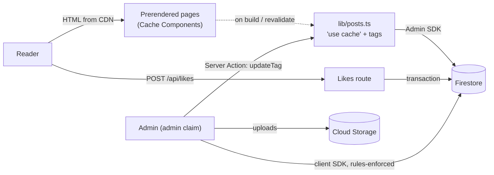

# Architecture

Signature is a personal technical blog. The design goals, in order: **secure by default, fast, cheap to run, simple to maintain**.

The public site is prerendered and served from the CDN. Firestore is read only when content changes, and readers download very little JavaScript. The Admin Studio is the only part of the app that loads the Firebase client SDK.

---

## 1. Request flow



- **Readers** get static HTML for home, topics, articles, about, feed, sitemap, search index and Open Graph images.
- **Writes** go through one of two paths:
  - The Admin Studio writes with the client SDK. Firestore and Storage rules require the `admin` custom claim.
  - Likes go through one server route that uses the Admin SDK.
- **Invalidation:** after every save or delete, the studio calls `revalidateContent()`, a Server Action that verifies the admin ID token and then calls `updateTag`. Changes appear immediately; otherwise caches refresh daily.

## 2. Stack

| Layer | Choice | Why |
| :--- | :--- | :--- |
| Framework | Next.js 16 App Router, Cache Components | Prerendering with `'use cache'`, tag-based invalidation |
| UI | React 19, Tailwind CSS v4 + typography | Server Components by default, zero-runtime CSS |
| Data | Cloud Firestore (Admin SDK on the server) | Managed, cheap at blog scale |
| Auth | Firebase Auth (Google) + `admin` custom claim | Claims are enforced in rules and on the server |
| Media | Cloud Storage | Images resized in the browser before upload |
| Markdown | unified: remark-gfm, rehype-sanitize, rehype-slug, Shiki | Rendered once per revalidation, not in the browser |
| Hosting | Vercel | CDN, ISR and Analytics |

## 3. Directory layout

```
src/
├── app/
│   ├── (site)/                  # Public pages sharing the header and footer
│   │   ├── page.tsx             # Home: featured post + latest list
│   │   ├── topics/[topic]/      # Static topic pages
│   │   ├── blog/[slug]/         # Article page + per-article OG image
│   │   └── about/
│   ├── admin/                   # Admin Studio (client) + actions.ts (revalidation)
│   ├── api/likes/               # The only dynamic route
│   ├── feed.xml/  search-index.json/  sitemap.ts  robots.ts  opengraph-image.tsx
│   └── layout.tsx               # Root: fonts, theme script, providers, analytics
├── components/
│   ├── blog/                    # Post list/cards, article islands, search
│   ├── layout/                  # Header, Footer, Wordmark, ThemeProvider
│   ├── about/  admin/  seo/  ui/
├── lib/
│   ├── posts.ts                 # Cached data access (server-only)
│   ├── markdown.ts              # Markdown → sanitized HTML + headings
│   ├── firebase.ts              # Client SDK (Admin Studio only)
│   ├── firebase-admin.ts        # Admin SDK (server only)
│   └── categoryUtils.ts  format.ts  github.ts  og.tsx  site.ts
└── types/blog.ts
```

## 4. Data model

**`blog/{postId}`**

| Field | Type | Notes |
| :--- | :--- | :--- |
| `title`, `slug`, `excerpt`, `content` | string | `slug` must match `^[a-z0-9-]+$`; `content` is Markdown |
| `category` | string | One of the four topics in `TOPICS` |
| `tags` | string[] | |
| `coverImage` | string | Required when `featured` |
| `published`, `featured` | boolean | Drafts are readable only by admins |
| `readingTime` | number | Minutes, stored on save |
| `likes` | number | Written only by `/api/likes` |
| `createdAt`, `updatedAt` | Timestamp | |

**`blog/{postId}/likers/{hash}`**: one document per reader per post. The ID is `sha256(ip:postId:LIKE_HASH_SALT)`, so raw IPs are never stored. Only the Admin SDK can access these.

**`config/site`**: `siteTitle`, `siteDescription`, `author`, `email`, `github`, `linkedin`, `twitter`. Public read, admin write.

## 5. Caching

| Function | Tags | Lifetime |
| :--- | :--- | :--- |
| `getPublishedPosts()` | `posts` | `days` |
| `getPostBySlug(slug)` | `posts`, `post:<slug>` | `days` |
| `getSiteConfig()` | `config` | `days` |
| Feed, search index | `posts` (+ `config`) | `days` |
| GitHub repos (About) | none | `days` (`hours` on API failure) |

- `generateStaticParams` prerenders every published article, its OG image and every topic page.
- New slugs render on first request and are then cached.
- A like change calls `revalidateTag('post:<slug>', 'max')`, so the count refreshes in the background.

## 6. Security model

- **Authorization:**
  - Firestore and Storage rules require `request.auth.token.admin == true` for every write.
  - Published posts and site config are public; everything else is denied.
  - The studio's `AuthGuard` only controls what's shown; enforcement lives in the rules and on the server.
- **Storage:** uploads must be raster images under 5 MB (no SVG or HTML). Files are publicly fetchable but not listable.
- **Server routes:**
  - `/api/likes` is same-origin only, validates its input, deduplicates per reader, and runs in a transaction.
  - `revalidateContent()` verifies the ID token and the admin claim.
- **Content:** raw HTML in Markdown passes through `rehype-sanitize` (no scripts, iframes, forms, event handlers or inline styles).
- **Headers** (`next.config.ts`):
  - A CSP without nonces, so pages stay static.
  - HSTS, `nosniff`, `X-Frame-Options: DENY`, Referrer-Policy and Permissions-Policy.
- **Tests:** `npm run test:rules` runs the rules suite against the emulators.

## 7. Client JavaScript

Pages are Server Components. The only client islands are:

| Island | Where | Purpose |
| :--- | :--- | :--- |
| `SiteHeader` / `Header` | All public pages | Mobile menu, Cmd/Ctrl+K |
| `SearchModal` | On open | `<dialog>`; fetches `/search-index.json` once |
| `ThemeProvider` / `ThemeToggle` | All pages | Theme stored on `<html>`; circular view-transition reveal |
| `LikeButton`, `ShareButton` | Articles | Optimistic likes; native share sheet |
| `ArticleEnhancer` | Articles | Code copy buttons; `<dialog>` image lightbox |
| `TableOfContents` | Articles (desktop) | Highlights the current section |

The reading progress bar uses a CSS scroll-driven animation and no JavaScript.

## 8. Motion

Animation is CSS and browser-native only; there is no animation library. The rules:

- **Compositor-only.** Animate `transform`, `opacity` (and the individual `translate`, `scale`, `rotate` properties). Color transitions are allowed. Never use `transition: all`, and never animate `width`, `height`, `top` or `margin`. The single exception is `grid-template-rows` for collapsing toasts and admin list rows.
- **Short.** Hover and press 120-180 ms, enters 180-240 ms, exits shorter than enters.
- **Progressive.** Anything that depends on a newer API sits behind `@supports` or degrades to an instant change (`@starting-style`, scroll-driven animations, the theme reveal).
- **Reduced motion.** `globals.css` ends with a global `prefers-reduced-motion: reduce` block that disables movement and timed effects. Smooth scrolling is gated by `no-preference`.
- **No page-to-page transitions.** Route changes are instant: there are no view transitions, shared-element morphs or crossfades between pages. Loading is shown with skeletons instead.

| Need | Use |
| :--- | :--- |
| Loading a page | a `loading.tsx` per route that renders a page-shaped skeleton (`ListSkeleton`, `AboutSkeleton`, `ArticleSkeleton`), built from `<Skeleton>` blocks with the `skeleton` shimmer |
| Matching the real layout | skeletons use the same container (`PageContainer`) and sizes as the page they stand in for, so nothing shifts when content arrives |
| Page width | `PageContainer` for the home, topic and About pages (one width and padding), so they line up |
| Slow navigations | `<LinkPending />` inside a `<Link>`; CSS pulses the link after 150 ms |
| Dialogs and menus | `@starting-style` plus `allow-discrete` `display`/`overlay` transitions, so they animate out too |
| Press and hover | the `press` and `lift` utilities (`scale` and `translate` compose) |
| Entrances | `animate-fade-up` + `stagger`, or the scroll-driven `reveal` class |

The one remaining view transition is the theme toggle's circular reveal, scoped to `html.theme-reveal`.
