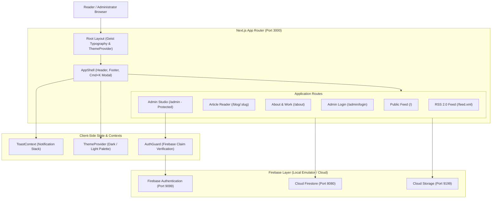
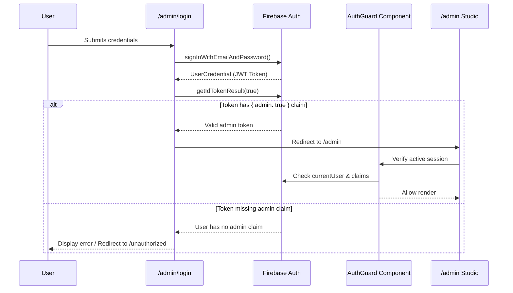

# System Architecture & Technical Specifications

This document outlines the architectural blueprint, data flow, component hierarchy, security model, and design principles behind **Project Signature**.

---

## 1. High-Level System Architecture

The following diagram illustrates how incoming client requests flow through Next.js, React Client Components, and the Firebase data layer:



---

## 2. Technology Stack & Rationale

| Layer | Technology | Rationale |
| :--- | :--- | :--- |
| **Framework** | **Next.js 16 (App Router)** | Hybrid Server/Client rendering, file-based routing, SEO dynamic metadata, and Turbopack compiler. |
| **UI Library** | **React 19** | Component-driven reactive UI with concurrent rendering and hooks. |
| **Styling** | **Tailwind CSS v4** | Utility-first, zero-runtime CSS with custom matte graphite palette (`#0d0f12`), dark mode support, and typography plugins. |
| **Typography** | **Geist & Geist Mono** | Clean, modern sans and monospace font families designed for readability and code rendering. |
| **Database** | **Google Cloud Firestore** | NoSQL document database providing real-time synchronization, compound querying, and schema flexibility. |
| **Authentication** | **Firebase Auth** | Industry-standard identity management with custom JWT claims (`admin: true`) for role-based access. |
| **Asset Storage** | **Firebase Cloud Storage** | Reliable object storage for article banner images and markdown media uploads. |
| **Markdown Engine** | **react-markdown + remark-gfm + rehype-raw** | Mixed HTML/GFM parser supporting embedded diagrams, tables, and raw formatting safely. |
| **Syntax Highlighting** | **react-syntax-highlighter (Prism atomDark)** | Syntax-colored code blocks with copy-to-clipboard functionality and terminal framing. |
| **Icons & Motion** | **Lucide React + Framer Motion** | Consistent iconography and hardware-accelerated micro-interactions (category pills, modal transitions). |

---

## 3. Directory Taxonomy

```
project-signature/
├── public/                 # Static public assets (SVGs, favicons, branding)
├── scripts/                # Administrative utilities (emulator seed, claim management)
├── src/
│   ├── app/                # Next.js App Router (pages, layouts, dynamic routes, API endpoints)
│   │   ├── about/          # Executive showcase, career timeline, and skills matrix
│   │   ├── admin/          # Unified Admin Studio (CRUD, drafts, media manager)
│   │   │   └── login/      # Administrator authentication portal
│   │   ├── api/            # Serverless HTTP endpoints (contact, portfolio, REST)
│   │   ├── blog/           # Publication feed and category filtering
│   │   │   └── [slug]/     # Single article reader with sticky Table of Contents
│   │   ├── feed.xml/       # Dynamic RSS 2.0 endpoint for feed readers
│   │   ├── unauthorized/   # 403 Access Denied fallback page
│   │   ├── globals.css     # Global theme variables, utility styles, and typography
│   │   ├── layout.tsx      # Root HTML wrapper with fonts and dynamic site metadata
│   │   └── page.tsx        # Homepage root route (renders publication feed)
│   ├── components/         # Reusable modular React components
│   │   ├── admin/          # Admin-specific components (AuthGuard, role enforcement)
│   │   ├── blog/           # Reader components (CodeBlock, TableOfContents, ReadingProgress, SearchModal)
│   │   ├── features/       # Feature modals and dialogs (SocialsModal)
│   │   ├── layout/         # Core layout chrome (Header, Footer, AppShell, ThemeProvider)
│   │   ├── providers/      # Third-party SDK wrappers (FirebaseAnalytics)
│   │   └── ui/             # General-purpose UI atoms (Toast)
│   ├── context/            # React context providers (ToastContext)
│   ├── hooks/              # Custom reusable hooks (useToast)
│   └── lib/                # Shared utilities, Firebase client/admin singletons, static portfolio data
├── SETUP.md                # Local environment and emulator setup instructions
├── ARCHITECTURE.md         # Detailed architectural documentation (this document)
└── README.md               # Repository overview and quick start guide
```

---

## 4. Data Architecture & Schemas

### 4.1. Firestore Document Models

#### `blog` Collection (Articles)
Each document represents a published or draft article:

| Field | Type | Description |
| :--- | :--- | :--- |
| `id` | `string` | Auto-generated document ID or slug identifier |
| `title` | `string` | Article headline |
| `slug` | `string` | URL-safe slug (e.g., `zero-downtime-migration-http3`) |
| `excerpt` | `string` | Short lead paragraph for preview cards |
| `content` | `string` | Raw Markdown / HTML string |
| `category` | `string` | Primary topic (`Web & Software`, `Cloud & Data`, `Artificial Intelligence`, `Guides & Tips`) |
| `tags` | `string[]` | Searchable tag tokens (e.g., `["HTTP3", "Networking"]`) |
| `published` | `boolean` | Publication state (draft vs. live) |
| `featured` | `boolean` | Pin status on the feed |
| `views` | `number` | Incremental read counter |
| `likes` | `number` | Reader engagement counter |
| `createdAt` | `Timestamp` | Original authoring timestamp |
| `updatedAt` | `Timestamp` | Last modification timestamp |

#### `config/site` Document (Site Metadata)
Global configuration singleton consumed by `layout.tsx` and `Footer.tsx`:

| Field | Type | Description |
| :--- | :--- | :--- |
| `siteTitle` | `string` | Browser title bar fallback |
| `siteDescription` | `string` | Meta description for search engines |
| `author` | `string` | Site owner name |
| `tagline` | `string` | Subtitle for editorial branding |
| `bio` | `string` | Short introductory paragraph |
| `github` | `string` | GitHub profile URI |
| `linkedin` | `string` | LinkedIn profile URI |

---

## 5. Security Model & Authentication



### Role-Based Access Control (RBAC)
- All administrative routes (`/admin`) are wrapped in `AuthGuard.tsx`.
- Security does **not** rely on email hardcoding or insecure client state; it inspects Firebase Custom Claims (`tokenResult.claims.admin === true`).
- In local emulator mode, `seed-emulator.mjs` grants this claim to `kmkrworks@gmail.com` using the Firebase Admin SDK.

---

## 6. Reader Ergonomics & Typography Pipeline

The blog reader (`/blog/[slug]`) implements several UX patterns:

1. **Hardware-Accelerated Reading Progress**:
   `ReadingProgressBar.tsx` attaches a passive scroll listener and calculates scroll depth percentage, driving a fixed 2.5px gradient bar along the screen top.

2. **Mixed Markdown & HTML Pipeline**:
   Articles pass through `ReactMarkdown` with `rehype-raw` enabled. This allows inline HTML formatting (such as semantic tables, figures, and styling) while preserving Markdown convenience.

3. **Sticky Dynamic Table of Contents**:
   `TableOfContents.tsx` uses an `IntersectionObserver` to spy on rendered `<h2>` and `<h3>` tags in the article canvas. It highlights the current section in the right sidebar (`sticky top-20`) and provides smooth one-click scrolling.

4. **Zero-Latency Optimistic Likes**:
   Clicking the like button updates local React state immediately (0ms visual feedback) while firing an asynchronous Firestore `updateDoc` with `increment(1)` in the background. Duplicate likes are prevented per session using `sessionStorage`.

5. **Universal Command Palette (Cmd+K / Ctrl+K)**:
   `SearchModal.tsx` provides instant, client-side indexing across titles, excerpts, and tags without re-fetching from the database.
